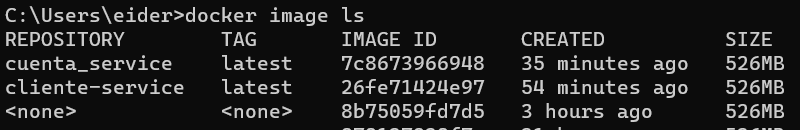

# 🚀 Configuracion de proyecto en docker 🚀

## 1 > Contruir las configuraciones en maven

```
mvn clean install
```
- El proyecto encargado de los script de base de datos es **cliente_service**, cuando se ejecuta, por temas de los test, se le debe agregar -DskipTests, es decir:
```
mvn clean install -DskipTests
```
Se puede omitir si las propiedades en **application.properties** tienen los valores
```
spring.jpa.hibernate.ddl-auto=none
spring.sql.init.mode=never
```

- Creados los jar correspondientes, se procede a crear las imagenes con los siguientes tag
> - cliente-service
> - cuenta_service

Ejecutando en la carpeta raiz de cada microservicio
```
docker build -t cliente-service:v1 .
docker build -t cuenta_service:v1 .
```
Se pueden verificar con el siguiente comando 
```
docker image ls
```

__________________________________________

## 2> Configuracion de la base de datos docker

- Se debe bajar la image de mariadb
```
docker pull mariadb
```
- Para fines de persistencia, dentro del archivo **docker-compose.yml** se cambia la ruta **_/d/Docker/mariadb_data_** y poner la ruta que desee
- Por ultimo ejecutar el comando de docker compose en el directorio raiz del todo el proyecto _./microservicios_devsu_
```
docker-compose up
```
